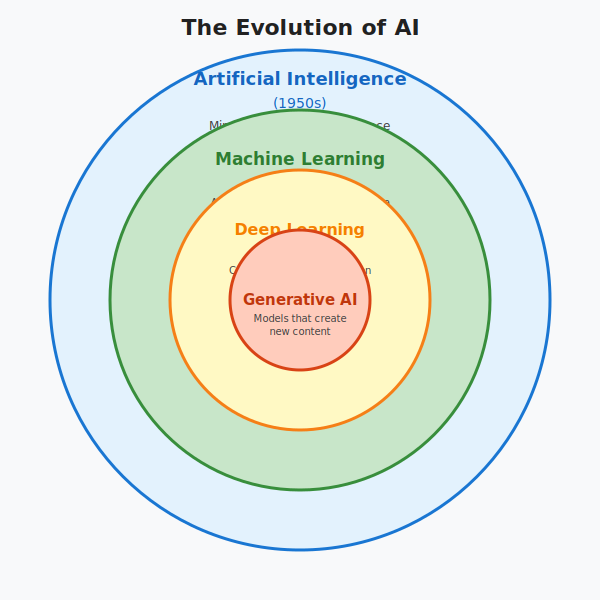
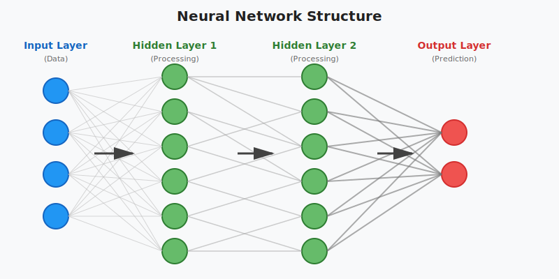
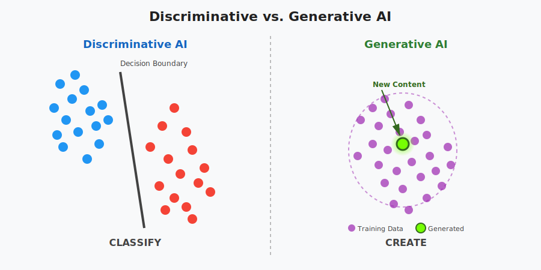

# Introduction to Generative AI

## The Evolution of AI (The Hierarchy)

It is crucial to understand where Generative AI sits within the broader history of computer science.

1.  **Artificial Intelligence** (1950s) - Mimicking human intelligence.
2.  **Machine Learning** (1980s) - Algorithms that learn from data.
3.  **Deep Learning** (2000s) - Complex pattern recognition using multi-layer neural networks.
4.  **Generative AI** - Models that create _new_ content.

### Key Definitions:

- **Artificial Intelligence (AI):** A broad field enabling machines to mimic human intelligence (e.g., Siri, Fraud Detection).
- **Machine Learning (ML):** A subset of AI where systems learn from data to improve performance without explicit programming (e.g., Linear Regression).
- **Deep Learning (DL):** A subset of ML using multi-layered neural networks (inspired by the human brain) to learn hierarchical features from vast amounts of data.

---

## Deep Learning Refresher

Generative AI relies heavily on Deep Learning concepts.

- **Neural Networks:** Interconnected layers of nodes that process data like neurons in a brain.
- **How They Learn:**
  1.  **Forward Propagation:** Pass inputs forward to make a prediction.
  2.  **Loss Calculation:** Compare prediction to the actual value.
  3.  **Backward Propagation:** Adjust weights to minimize errors.

---

## Discriminative vs. Generative AI

This is the fundamental shift in technology.

| Feature           | Discriminative AI                                   | Generative AI                          |
| :---------------- | :-------------------------------------------------- | :------------------------------------- |
| **Core Function** | Classify or Predict                                 | Create New Content                     |
| **Goal**          | Draw a line (decision boundary) between data points | Learn the underlying data distribution |
| **Output**        | A label (e.g., "Spam/Not Spam"), number, or ranking | New text, images, audio, or video      |
| **Examples**      | Fraud detection, Spam filters                       | GPT-4, Midjourney, Sora                |

---

## Generative AI Modalities

Generative AI is not just about text. It spans multiple media types.

- **Text:** Writing emails, code, or summaries. (Models: GPT-4, Claude, Llama).
- **Images:** Generating illustrations or product shots. (Models: DALL-E 3, Midjourney).
- **Audio:** Cloning voices or generating music. (Models: Whisper, Suno).
- **Video:** Creating short videos from text. (Models: Sora, Runway Gen-2).
- **3D/Code:** Generating 3D meshes or software functions. (Models: GitHub Copilot, Shap-E).

---

## Why AI Matters

- **Productivity:** Boosting developer and team efficiency.
- **Discovery:** Improving search and product discovery.
- **Automation:** Streamlining customer support and supply chain operations.
