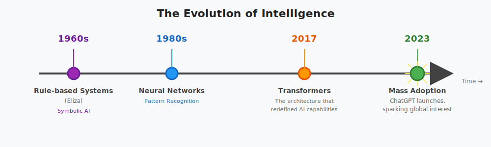
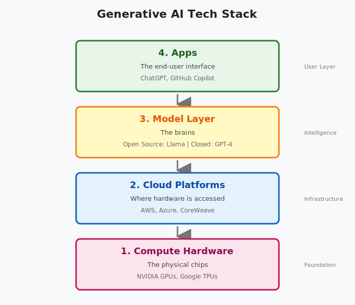
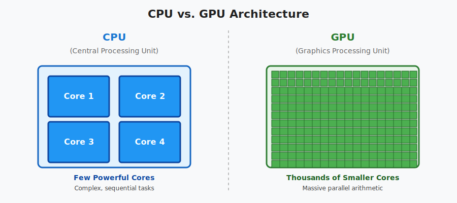
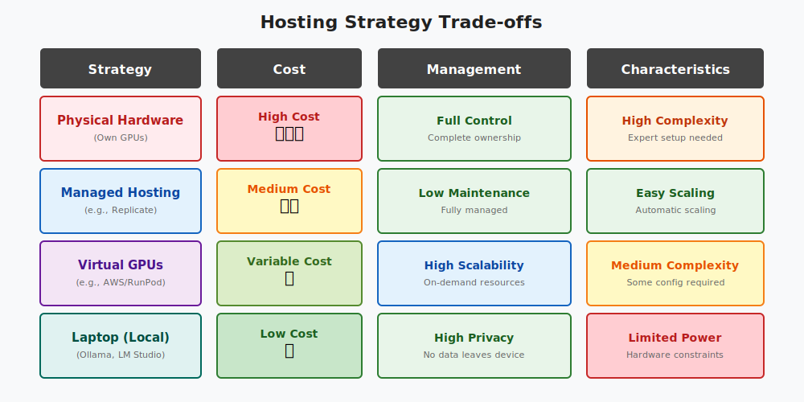

# The Generative AI Landscape & Infrastructure

## 1. The Evolution of Intelligence

To understand where we are, we must look at the timeline of AI development.

- **1960s:** Rule-based systems (Eliza) - _Symbolic AI_
- **1980s:** Neural Networks - _Pattern Recognition_
- **2017:** Transformers - _The architecture that redefined AI capabilities_
- **2023:** Mass Adoption - _ChatGPT launches, sparking global interest_

### Why Now? (The Convergence)

Three factors converged to make 2025 the era of GenAI:

1.  **Data Explosion:** Massive datasets from the internet and enterprise apps.
2.  **Computing Power:** The rise of GPUs and specialized hardware.
3.  **Breakthroughs:** Transformer architecture and self-supervised learning.

---

## 2. The Generative AI Tech Stack

Building a GenAI system involves four distinct layers.

1.  **Compute Hardware:** The physical chips (NVIDIA GPUs, Google TPUs).
2.  **Cloud Platforms:** Where hardware is accessed (AWS, Azure, CoreWeave).
3.  **Model Layer:** The brains (Open Source: Llama / Closed: GPT-4).
4.  **Apps:** The end-user interface (ChatGPT, Github Copilot).

---

## 3. Infrastructure: The Engine of AI (GPUs)

Standard CPUs cannot handle the workload of Generative AI. We rely on **GPUs (Graphics Processing Units)**.

### CPU vs. GPU

### Why GPUs?

- **Parallelism:** LLMs require trillions of matrix multiplications. GPUs execute thousands of these simultaneously.
- **Bandwidth:** High memory bandwidth keeps data flowing to the cores without bottlenecks.
- **Market Reality:** NVIDIA is the dominant player ("selling shovels in a gold rush"), with massive demand driving stock growth and hardware scarcity.

### Cloud Infrastructure

Most developers do not buy GPUs; they rent them.

- **Hyperscalers:** AWS, Google Cloud, Azure.
- **Specialized AI Clouds:** CoreWeave, Lambda, RunPod. These often offer lower costs, faster availability, and are optimized specifically for AI workloads.

---

## 4. The Model Layer: Open vs. Closed

There are two ways to access LLMs: via API (Proprietary) or by downloading weights (Open Source).

**Comparison Table:**

| Feature      | **Proprietary (Closed Source)**                              | **Open Source (Open Weights)**                              |
| :----------- | :----------------------------------------------------------- | :---------------------------------------------------------- |
| **Examples** | OpenAI (GPT-4), Anthropic (Claude), Google (Gemini)          | Meta (Llama), Mistral, DeepSeek, Alibaba (Qwen)             |
| **Access**   | Accessed via API over the internet                           | Downloadable weights; can run locally                       |
| **Pros**     | Easy to start, no infrastructure management, highly scalable | Full control, data privacy, no vendor lock-in, customizable |
| **Cons**     | Data leaves your secure environment, cost scales with usage  | Requires managing your own GPU infrastructure               |

### Running Locally

For privacy or prototyping, you can run models on your own laptop using tools like **Ollama** or **LM Studio**. This allows for offline work and zero data leakage.

---

## 5. Hosting Strategy Trade-offs

Deciding where to run your model depends on your budget and requirements.

**Trade-off Matrix**

