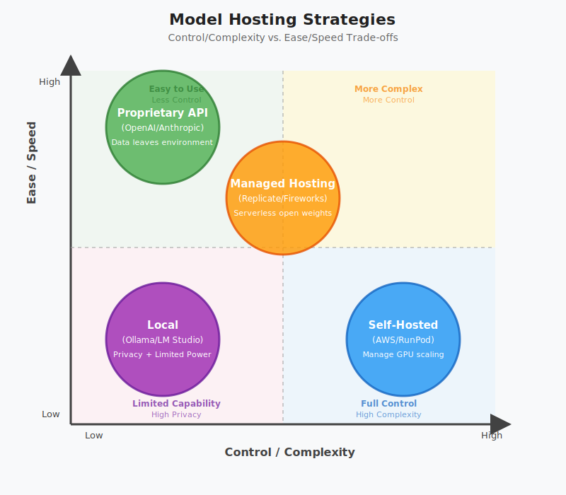
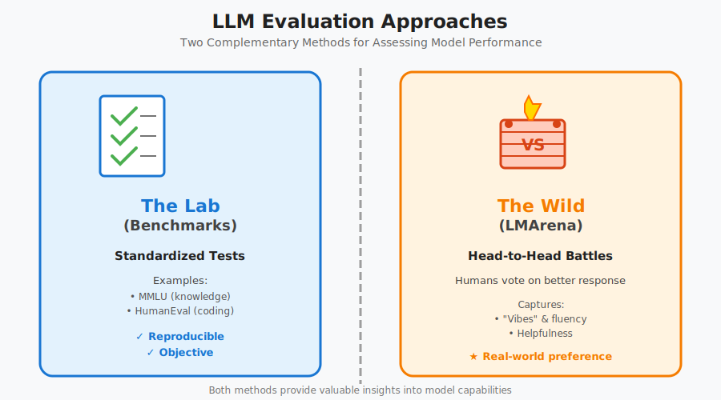
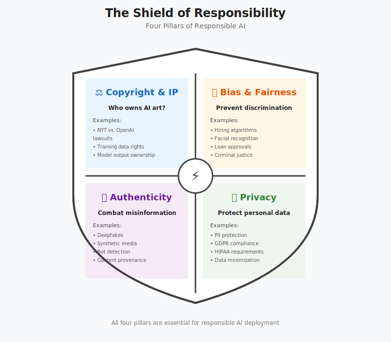

# Applications, Evaluation & Responsible AI

## 1. Industry Updates & Trends

The AI landscape moves fast. Recent developments highlight the trend toward efficient and specialized models.

- **Small Language Models (SLMs):** Google released **Gemma 3 270M**. These "tiny yet mighty" models are ideal for specific tasks (sentiment analysis, routing) where low latency and privacy are critical.
- **System Orchestration:** Eleven Labs' "Jingle Maker" proves that user experiences are often model-agnostic pipelines. The system chains multiple tools: `Parse Website -> Generate Lyrics -> Route to Music Generator`.

---

## 2. Model Hosting Strategies

Choosing _how_ to run a model is a critical architectural decision.

- **Proprietary API (OpenAI/Anthropic):** High Ease, Low Control. Data leaves your environment.
- **Managed Hosting (Replicate/Fireworks):** Medium Ease, Medium Control. Serverless access to open weights.
- **Self-Hosted (AWS/RunPod):** Low Ease, High Control. You manage the GPU scaling.
- **Local (Ollama/LM Studio):** Best for privacy and prototyping, limited by laptop hardware,.

---

## 3. Evaluating LLMs (Benchmarks)

How do we know if a model is "good"? We use two complementary approaches.

### Key Concept: LLM-as-a-Judge

Scaling human evaluation is expensive. We now use strong models (like GPT-4) to grade the outputs of smaller models.

- **Pros:** Fast, cheap, and consistent.
- **Cons:** The judge may have biases (favoring its own style),.

---

## 4. The Application Layer

Applications are the "wrappers" that translate raw model capabilities into business value.

### Use Cases:

- **Horizontal:** Productivity, Marketing Copy, Code Generation.
- **Vertical:** Healthcare (Medical advice), Legal (Contract review), Biology.
- **Enterprise (e.g., Walmart):** Catalog enrichment, semantic search, and multilingual support.

---

## 5. Responsible AI & Ethics

As we deploy systems, we must navigate ethical risks.

### Principles for Production:

- **Fairness:** Treat all user groups equitably.
- **Transparency:** Users should know they are interacting with AI.
- **Accountability:** Humans must remain responsible for the system's output,.

