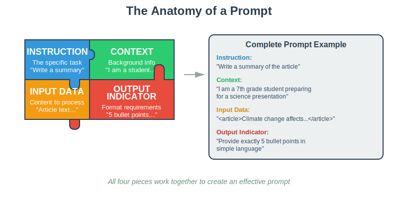
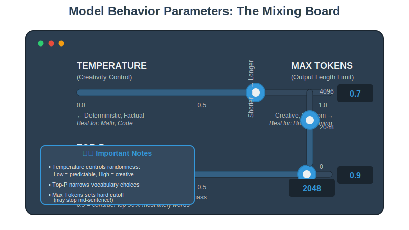
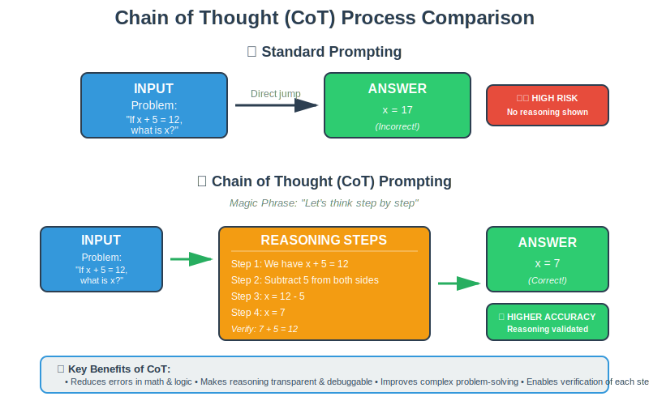
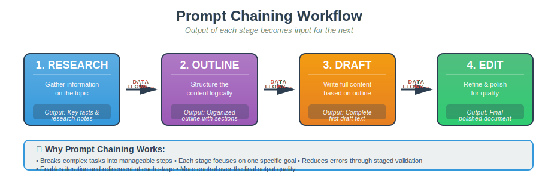

# Prompt Engineering & Optimization

## 1. What is a Prompt?

A prompt is the input instruction given to an AI model to generate a response. The quality of the output depends directly on how clear, detailed, and structured the prompt is.

**The Anatomy of a Prompt**

1.  **Instruction:** The specific task (e.g., "Write a summary").
2.  **Context:** Background info (e.g., "I am a student in class 7").
3.  **Input Data:** The content to process (e.g., "Here is the article text...").
4.  **Output Indicator:** Format requirements (e.g., "5 bullet points in JSON").

---

## 2. Model Behavior Parameters

Prompts are not the only factor; configuration settings determine _how_ the model “thinks.”

**The Mixing Board**

- **Temperature (Creativity):**
  - _Low (≈0.1):_ Deterministic, factual. (Best for Math/Code).
  - _High (≈0.9):_ Random, creative. (Best for Brainstorming).
- **Top-P (Nucleus Sampling):** Restricts the token pool to the top X% probability mass. (e.g., 0.9 = consider top 90% likely words).
- **Max Tokens:** Defines the cutoff length. _Note: The model simply stops when this limit is hit, often mid-sentence_.

---

## 3. Core Prompting Techniques

Different tasks require different strategies.

### A. Zero-Shot vs. Few-Shot

- **Zero-Shot:** Asking without examples. (e.g., "Write an email...").
- **Few-Shot:** Providing examples to guide the pattern. (e.g., "Positive: Great! / Negative: Bad. / Input: It broke. Output: Negative").

### B. Role Prompting

Assigning a persona to control style and tone.

- _Example:_ "You are a Chief Legal Officer. Review this contract for risks.".

### C. Chain of Thought (CoT)

Encouraging the model to explain its reasoning _before_ giving the answer. This reduces errors in math and logic.

- **Magic Phrase:** "Let's think step by step".

**Chain of Thought Process**

- **Standard Prompting:** Input -> Answer (High risk of error).
- **CoT Prompting:** Input -> "Reasoning: Step 1... Step 2..." -> Answer (Higher accuracy).

### D. Prompt Chaining

Breaking complex workflows into subtasks where the output of one prompt becomes the input for the next.

**Prompt Chaining Workflow**

- _Flow:_ `Research -> Outline -> Draft -> Edit`.

---

## 4. Best Practices

- **Be Direct:** Treat the model like a brilliant new employee who lacks context.
- **Use Delimiters:** Use XML tags (e.g., `<contract> ... </contract>`) to clearly separate instructions from data.
- **System Prompts:** Use the system message to set global rules (e.g., "Always answer in JSON").
- **Prompt Libraries:** Maintain a collection of pre-tested prompts to ensure team consistency.

