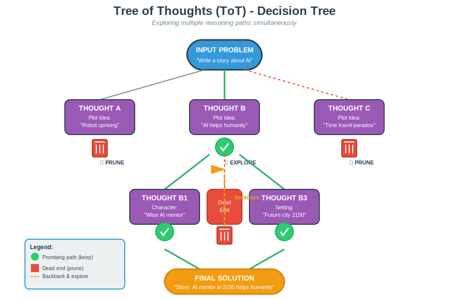
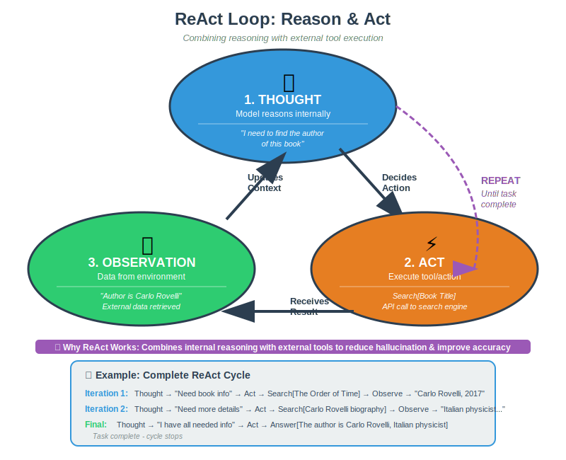
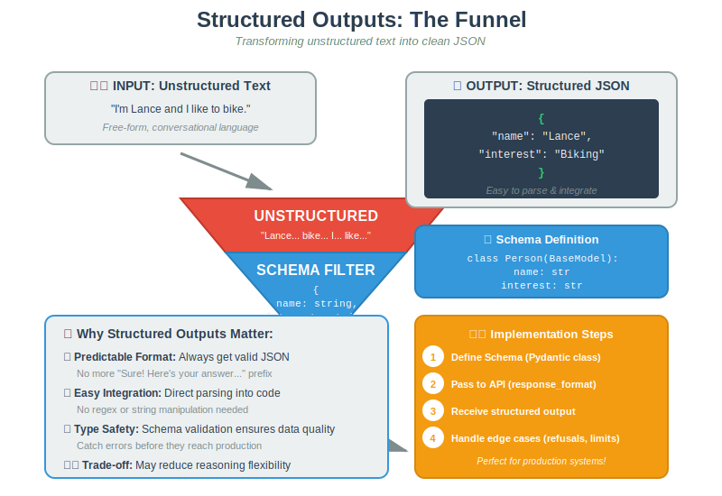

# Advanced Prompting & Structured Outputs

## 1. Advanced Reasoning Patterns

Beyond standard Chain of Thought, we can use complex structures to improve reasoning capabilities for difficult tasks.

### A. Generated Knowledge Prompting

Instead of asking the model to answer immediately, ask it to generate relevant facts first.

- **Concept:** Generate knowledge -> Integrate knowledge -> Answer Question.
- **Use Case:** Commonsense reasoning where the model might hallucinate without a "refresher".

### B. Self-Consistency

For tasks involving arithmetic or logic, a single "Chain of Thought" might be wrong.

- **Method:**
  1.  Prompt the model multiple times with the same question.
  2.  Generate diverse reasoning paths.
  3.  Take a **Majority Vote** (consensus) to select the final answer.
- **Trade-off:** Increases accuracy/reliability but incurs higher compute costs.

---

## 2. Tree of Thoughts (ToT)

ToT mimics human problem-solving by exploring multiple possibilities simultaneously rather than a single linear path.

- **Root:** Input Problem (e.g., "Write a story").
- **Branches:** Multiple "Thoughts" or intermediate steps (e.g., Plot Idea A, Plot Idea B).
- **Evaluation:** Some branches are marked with a "Check" (keep going), others with a "Trash Can" (prune/stop).
- **Action:** The model backtracks from dead ends to explore promising branches.

### Use Cases vs. Cost

- **Best For:** Strategic planning, creative writing (exploring plot twists), and complex math (Game of 24),.
- **Trade-off:** ToT has a much higher success rate (74% vs 4% for standard CoT in some tests) but requires significantly more computation and cost,.

---

## 3. ReAct (Reason & Act)

Large Language Models have internal knowledge but cannot access the outside world. ReAct bridges this gap.

1.  **Thought:** The model reasons about what it needs (e.g., "I need to find the author of this book").
2.  **Act:** The model executes a tool/action (e.g., `Search[Book Title]`).
3.  **Observation:** The model receives data from the environment (e.g., "Author is Carlo Rovelli").

- _Repeat until finished._

- **Why it matters:** Standard CoT suffers from hallucinations; "Act-only" suffers from a lack of reasoning. ReAct combines both for interpretable, factual trajectories.

---

## 4. Multi-Modal Prompting

Prompting is no longer limited to text.

- **Inputs:** You can provide URLs or Base64 images alongside text instructions.
- **Applications:**
  - _Retail:_ Scan shelf photos to find missing stock.
  - _Finance:_ Parse charts into text summaries.

---

## 5. Structured Outputs (JSON)

For production systems, free-text answers are difficult to parse. We need predictable data formats.

### The Problem

LLMs naturally output unstructured text (e.g., "Sure! Here is the summary...").

- **Input:** "I'm Lance and I like to bike."
- **Filter (Schema):** A definition like `{name: string, interest: string}`.
- **Output:** A clean JSON object: `{"name": "Lance", "interest": "Biking"}`.

### Implementation Steps

1.  **Define Schema:** Use Pydantic to create a clear class structure (e.g., `class MathResponse(BaseModel)`).
2.  **Pass to API:** Include the schema in the `response_format` or `text_format` parameter of the API call.
3.  **Handle Edge Cases:** Plan for refusals (safety) or length limits (incomplete JSON).

### Limitations

- **Reasoning Penalty:** Restricting the format can sometimes reduce the model's reasoning quality compared to free-form text.
- **Complexity:** Defining schemas for deeply nested or complex legal documents is time-consuming.

