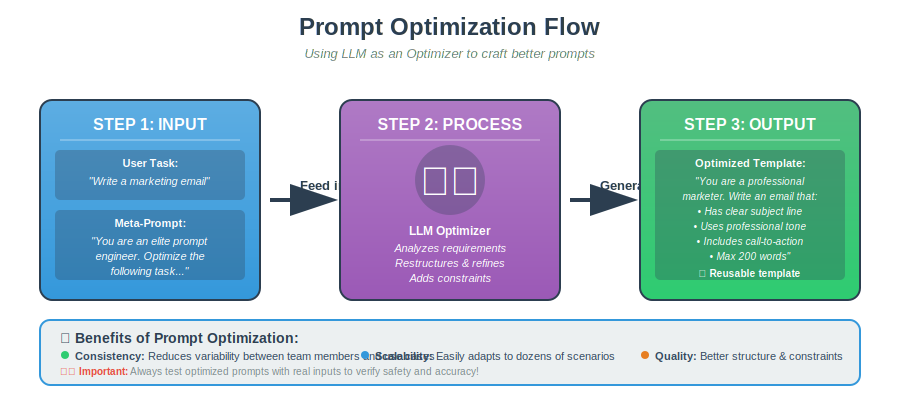
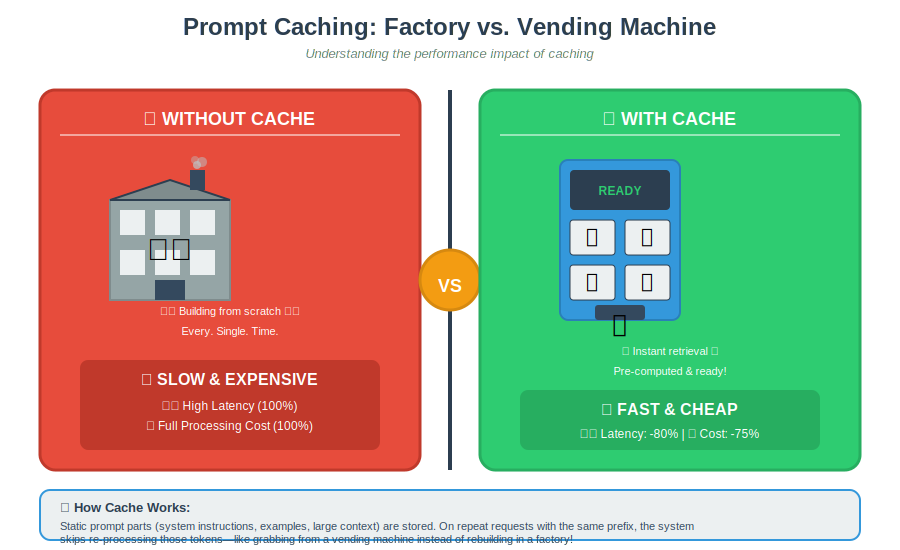
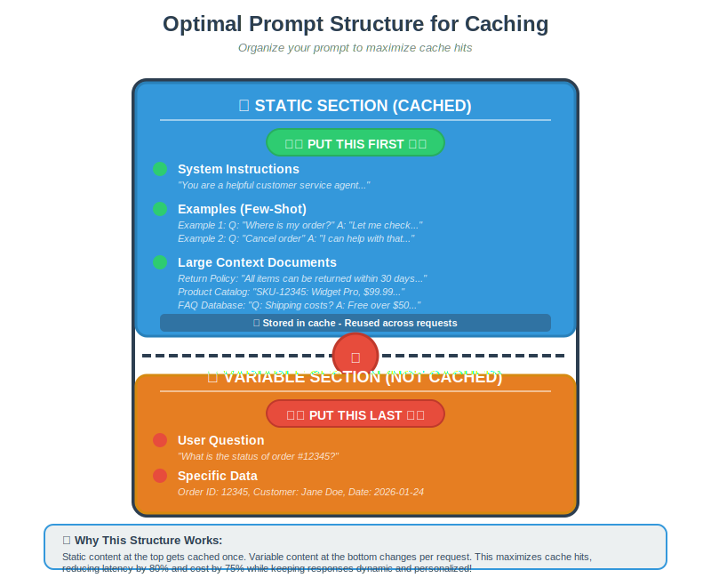

# Prompt Optimization & Caching

## 1. Prompt Optimization

Writing effective prompts manually is difficult. It requires trial and error, overlooks edge cases (safety/tone), and is hard to scale across teams.

### The Solution: LLM-as-an-Optimizer

Instead of manual crafting, we use an LLM to write the prompt for us.

1.  **Input:** User Task (e.g., "Write a marketing email") + Meta-Prompt ("You are an elite prompt engineer...").
2.  **Process:** The LLM "Optimizer" restructures the request.
3.  **Output:** A structured, reusable template with clear objectives and constraints.

**Benefits:**

- **Consistency:** Reduces variability between team members.
- **Scalability:** Easily adapts to dozens of use cases.
- **Validation:** _Crucial Step_ — Always test the optimized prompt with real user inputs to verify safety and accuracy.

---

## 2. Prompt Caching

As usage scales, cost and latency become critical. Prompt Caching addresses this by storing repetitive input data.

### How It Works

Many prompts share a static "Prefix" (System instructions, detailed guidelines, or few-shot examples).

- **Cache Miss:** If the prefix is new, the model processes the full prompt (High Latency/Cost).
- **Cache Hit:** If the prefix matches a stored entry, the system skips processing those tokens (Low Latency/Cost).

### The Impact

- **Latency:** Reduced by up to **80%**.
- **Cost:** Reduced by up to **75%**.
- **Integrity:** Caching _only_ affects the input processing. The output is still computed fresh every time, ensuring dynamic responses.

---

## 3. Caching Best Practices

To maximize cache hits, you must structure your prompts correctly.

### Implementation Details:

- **TTL (Time To Live):** Cache typically lasts 5–10 minutes (up to 1 hour off-peak). You need a steady stream of requests to keep the cache "warm".
- **Privacy:** Caches are usually per-model and per-deployment (not shared across different organizations).
- **What to Cache:** System messages, images, tool definitions, and structured output schemas.

