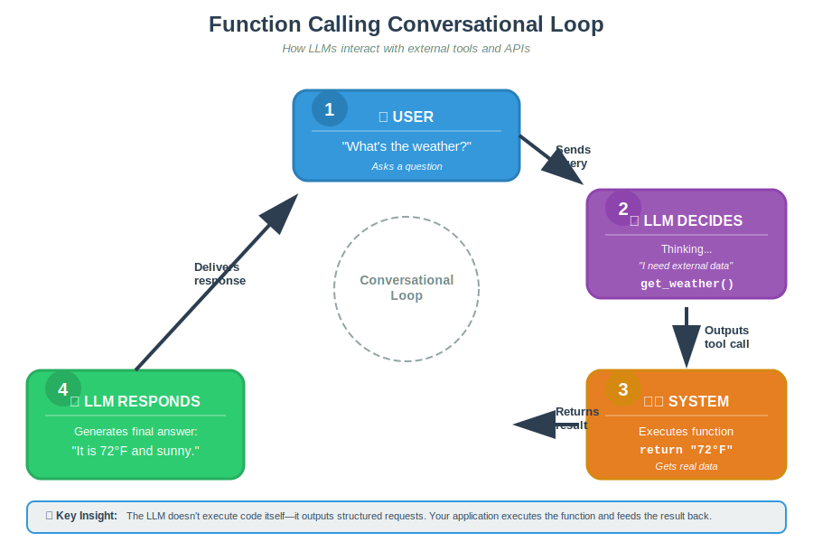
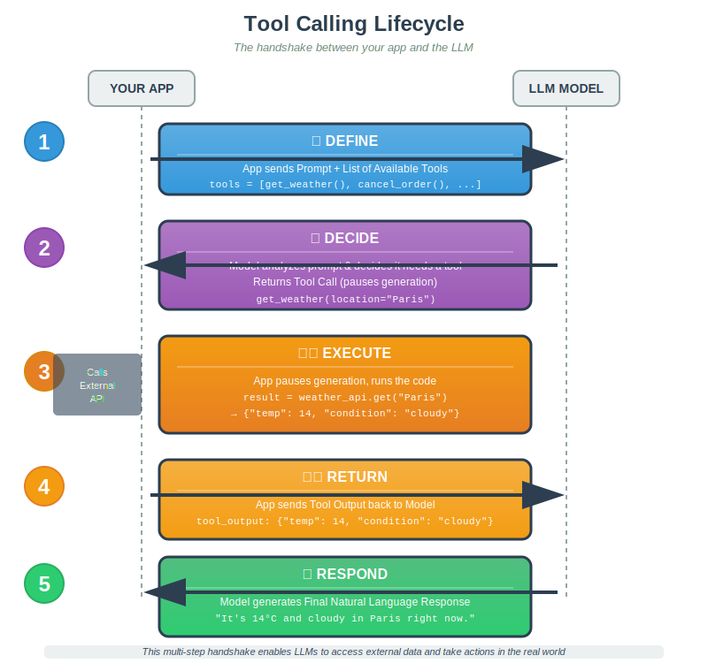

# Function Calling (Tool Calling)

## 1. What is Function Calling?

Standard LLMs are isolated; they can generate text but cannot take action or access private data. Function Calling (or Tool Calling) bridges this gap by enabling the model to interact with external systems and APIs in a structured way.

- **The Goal:** Connect the LLM to the "real world" so it can access live data (like weather) or perform actions (like issuing refunds).
- **The Mechanism:** The model doesn't execute code itself. It outputs a structured request (a "Tool Call"), which your application executes.

1.  **User:** "What's the weather?"
2.  **LLM:** Thinking... "I need external data." -> Outputs: `get_weather()`
3.  **System:** Executes code -> Returns `72°F`
4.  **LLM:** "It is 72°F and sunny."

---

## 2. Key Terminology

- **Tools:** The functionality you provide to the model (e.g., a weather lookup function, a database query tool).
- **Functions:** A specific type of tool defined by a JSON schema that passes structured data.
- **Tool Call:** The specific request generated by the model when it decides it needs help (e.g., `get_weather(location="Paris")`).
- **Tool Output:** The result returned by the code (usually JSON) which is fed back into the model to generate the final answer.

---

## 3. The Tool Calling Lifecycle

This is a multi-step "handshake" between the Model and your Code.

1.  **Define:** App sends the Prompt + List of Available Tools to the Model.
2.  **Decide:** Model analyzes the prompt. If it needs a tool, it pauses and returns a **Tool Call** (e.g., `get_weather("Paris")`).
3.  **Execute:** Your App pauses generation, runs the requested Python/API code, and gets the result (e.g., `{"temp": 14}`).
4.  **Return:** App sends the **Tool Output** back to the Model as a new message.
5.  **Respond:** Model uses this new data to generate the **Final Natural Language Response**.

---

## 4. Best Practices for Implementation

Since the model relies on your descriptions to understand _how_ to use the tools, clarity is key.

1.  **Be Descriptive:** The name and description of the function are part of the prompt. Make them obvious (e.g., use `cancel_order(order_id)` instead of a generic `update_status`).
2.  **Keep it Simple:** Aim for fewer than 20 active functions at once to maintain high accuracy.
3.  **Guide the Model:** Use the system prompt to explain _when_ to use specific tools (and when not to).
4.  **Action vs. Retrieval:** Distinctly separate tools that _read_ data (Data Retrieval) from tools that _change_ data (Action Execution).

---

## 5. Applications

Where is this used in production?

- **Data Retrieval:** querying databases naturally ("Show me my recent orders").
- **Action Execution:** Booking meetings, sending emails, or processing refunds.
- **Math/Logic:** Offloading complex calculations to a calculator tool instead of relying on the LLM's internal math (which is error-prone).
- **Agents:** This is the foundational technology behind autonomous agents that can browse the web or use computers.

