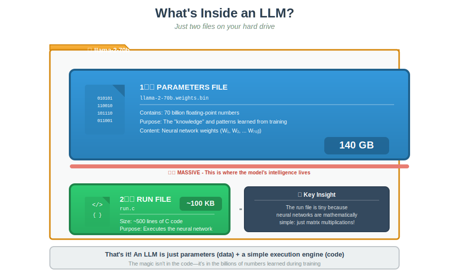
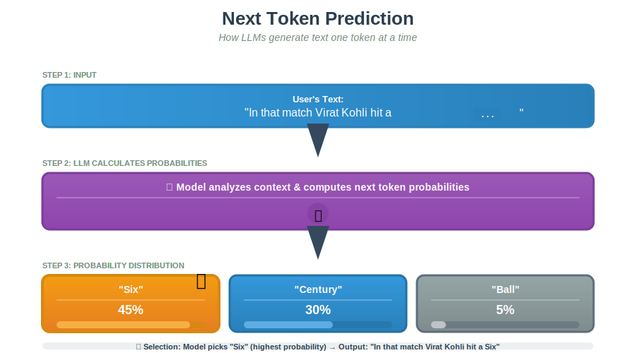
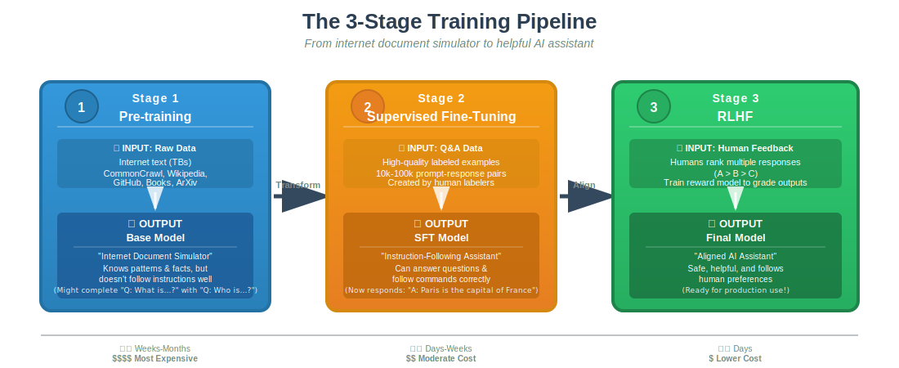

# Inside an LLM - Architecture & Training

## 1. What Exactly is an LLM?

At its simplest level, a Large Language Model (LLM) is not magic. It is essentially just two files sitting on a hard drive.

1.  **Parameters File:** A massive file (e.g., 140GB for Llama-2-70b) containing the "weights" or knowledge of the model.
2.  **Run File:** A very small code file (e.g., ~500 lines of C code) that executes the neural network.

- **Definition:** LLMs are deep learning systems trained on massive text datasets to understand, generate, and reason with human language.

---

## 2. How LLMs Work: Next Token Prediction

LLMs are prediction engines. They do not "know" facts in the human sense; they predict the statistically most likely next element in a sequence.

- **Input:** "In that match Virat Kohli hit a..."
- **Probabilities:**
  - _Six:_ 45%
  - _Century:_ 30%
  - _Ball:_ 5%
- **Selection:** The model selects "Six" based on the pattern it learned during training.

- **Architecture:** Most modern LLMs utilize the **Transformer** architecture (e.g., **G**enerative **P**re-trained **T**ransformer).

---

## 3. The Training Pipeline

Creating an LLM involves three distinct stages, moving from a raw "document simulator" to a helpful assistant.

1.  **Stage 1: Pre-training** (Raw Data) -> **Base Model**
2.  **Stage 2: Supervised Fine-Tuning** (Q&A Data) -> **SFT Model**
3.  **Stage 3: RLHF** (Human Feedback) -> **Final Model**

### Stage 1: Pre-training (Compressing the Internet)

- **Goal:** The model learns language patterns and facts by "reading" the internet (TBs of text).
- **Data:** Unlabeled, low quality, and massive (e.g., CommonCrawl, Wikipedia, GitHub).
- **Result:** A "Base Model" (or Internet Document Simulator). If you ask it a question, it might just generate another question because it thinks it is completing a list.
- **Constraint:** This stage is computationally expensive and resource-intensive.

### Stage 2: Supervised Fine-Tuning (SFT) / Instruction Tuning

- **Goal:** Teach the model to act as an assistant and answer questions.
- **Data:** High-quality "Prompt-Response" pairs created by human labelers (10k–100k examples).
- **Result:** An SFT Model that follows instructions.

### Stage 3: Reinforcement Learning from Human Feedback (RLHF)

- **Goal:** Align the model with human preferences (e.g., safety, helpfulness).
- **Process:**
  1.  Model generates multiple responses.
  2.  Humans rank them (Response A > Response B).
  3.  A "Reward Model" is trained to grade the LLM automatically.

---

## 4. The Data Bottleneck

We are consuming data faster than we create it.

- **Observation:** We trained on ~1.2 Trillion tokens (RedPajama/Llama datasets), including books, ArXiv papers, and code.
- **Risk:** We may run out of high-quality public internet data to train on in the next few years.

