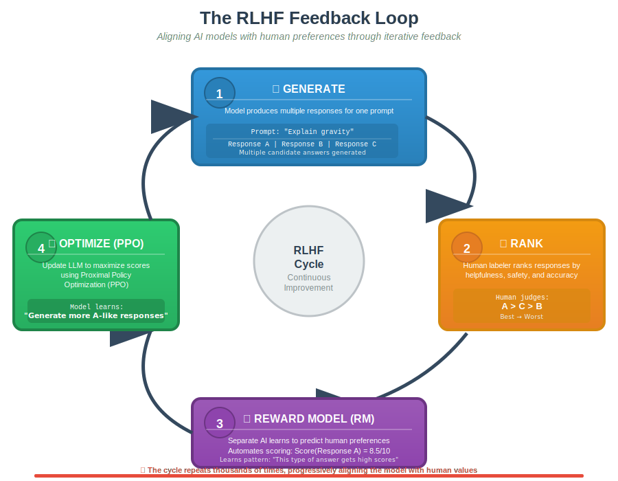
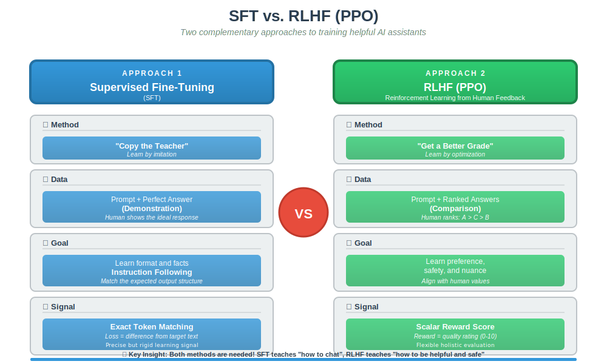
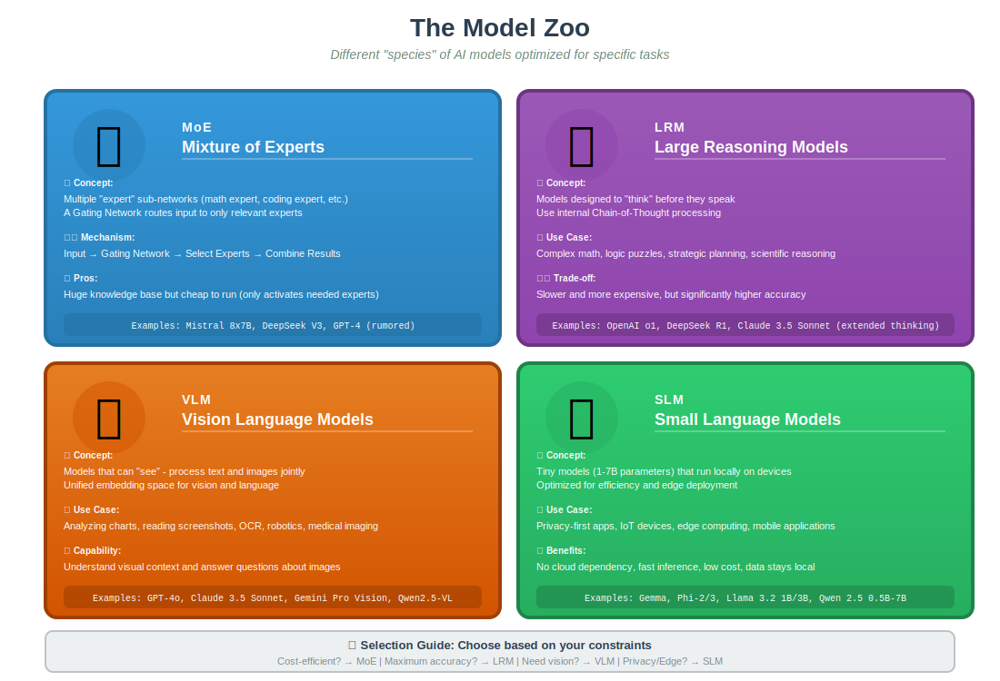
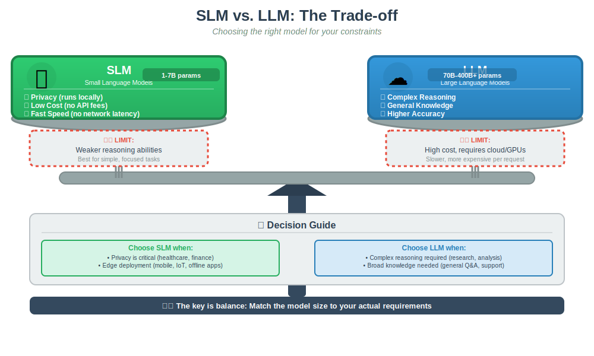

# RLHF & Advanced Model Architectures

## 1. The Missing Piece: Alignment (RLHF)

We previously covered Pre-training (learning facts) and SFT (learning to chat). However, models can still be unsafe, biased, or unhelpful. **Reinforcement Learning from Human Feedback (RLHF)** is the final polish that aligns the model with human values.

### How RLHF Works

1.  **Generate:** The model produces multiple answers (A, B, C) for a single prompt.
2.  **Rank:** A human labeler ranks them (e.g., A > C > B) based on helpfulness and safety.
3.  **Reward Model (RM):** A separate AI learns to predict these scores automatically.
4.  **Optimize (PPO):** The main LLM is updated using **Proximal Policy Optimization** to maximize these scores.

- _Analogy:_ If SFT is a teacher giving a student the answer key to copy, RLHF is a teacher giving the student a grade so they learn to improve on their own.

---

## 2. SFT vs. RLHF (PPO)

Why do we need both? They serve different purposes in the learning process.

---

## 3. Beyond the Standard "LLM"

The term "LLM" is becoming outdated. The ecosystem has split into specialized architectures optimized for different tasks.

### A. MoE (Mixture of Experts)

- **Concept:** Instead of one giant brain, the model has many "expert" sub-networks (e.g., a math expert, a coding expert).
- **Mechanism:** A **Gating Network** routes the input to only the relevant experts.
- **Pros:** Huge knowledge base but cheap to run (e.g., Mistral 8x7B, DeepSeek V3).

### B. LRM (Large Reasoning Models)

- **Concept:** Models designed to "think" before they speak. They use internal Chain-of-Thought processing.
- **Use Case:** Complex math, logic puzzles, and strategic planning (e.g., OpenAI o1, DeepSeek R1).
- **Trade-off:** Slower and more expensive, but higher accuracy.

### C. VLM (Vision Language Models)

- **Concept:** Models that can "see." They process text and images jointly.
- **Use Case:** Analyzing charts, reading screenshots, or robotics (e.g., GPT-4o, Qwen2.5-VL).

### D. SLM (Small Language Models)

- **Concept:** Tiny models (1–7B parameters) that run locally on devices.
- **Use Case:** Privacy-first apps, IoT, and edge computing (e.g., Gemma, Phi-2).

---

## 4. Selecting the Right Model

One size does not fit all. You must choose based on your constraints.

### Summary of Training Stages

1.  **Pre-training:** Learn language patterns (The "Base").
2.  **SFT:** Learn to follow instructions (The "Assistant").
3.  **RLHF:** Learn to behave safely (The "Aligned Product").

