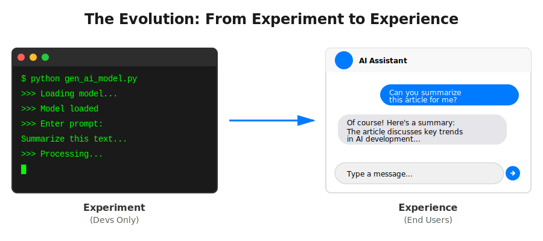

# Building Text Generation Apps

## 1. From Experiment to Experience

Real users cannot use a terminal. To create value, we must move "Beyond the Command Lines"

### Why upgrade?

- **Accessibility:** Non-technical users need buttons and text boxes, not code.
- **Integration:** Other apps need to talk to your model via API.

---

## 2. Two Key Approaches

There are two main ways to deploy your GenAI logic:

**Visual Aid (Architecture Split):**

- **Path A (Backend Service):** An invisible API layer that other apps (Mobile, Web) talk to. _Tool: FastAPI_.
- **Path B (End-to-End UI):** An all-in-one web app where Python generates the UI directly. _Tool: Streamlit_.

---

## 3. Backend Services: FastAPI

FastAPI is a modern web framework for building APIs with Python .

### Why FastAPI for AI?

- **Speed:** It handles many requests at once (Async by default) .
- **Validation:** It uses Pydantic to automatically check if inputs are valid (preventing bad data from crashing your model) .
- **Documentation:** It generates instant Swagger UI docs so other developers know how to use your API .
- **Industry Standard:** Even OpenAI uses FastAPI heavily within their internal monorepo to create APIs .

- _Example:_ You send a `POST /summarize` request, and the API returns a JSON summary .

---

## 4. Rapid Prototyping: Streamlit

Streamlit is a Python-first tool that turns data scripts into shareable web apps in minutes .

### Why Streamlit?

- **Zero Frontend Code:** You write Python (`st.text_input`, `st.button`), and it renders HTML/CSS automatically .
- **Speed to Demo:** Perfect for showing a Proof of Concept (POC) to stakeholders without hiring a frontend engineer .
- **Interactive:** Built-in support for chat interfaces, file uploads, and data visualization .

---

## 5. Decision Matrix: When to use what?

Choosing the right stack depends on your goal.

| Use Case                   | Recommended Tool | Why?                                                          |
| :------------------------- | :--------------- | :------------------------------------------------------------ |
| **Quick Prototype / Demo** | **Streamlit**    | Faster iteration; no frontend skills needed .                 |
| **Internal Dashboard**     | **Streamlit**    | Built-in data visualization .                                 |
| **Enterprise Integration** | **FastAPI**      | Connects to existing systems/workflows .                      |
| **Mobile App Backend**     | **FastAPI**      | Acts as a centralized API for multiple frontends .            |
| **Legacy Systems**         | **Flask/Django** | If your org is already heavy on these, don't fight the grain. |

